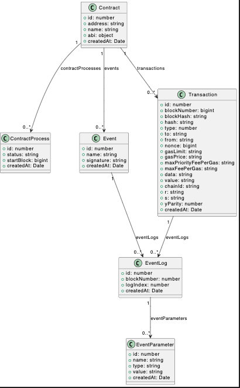
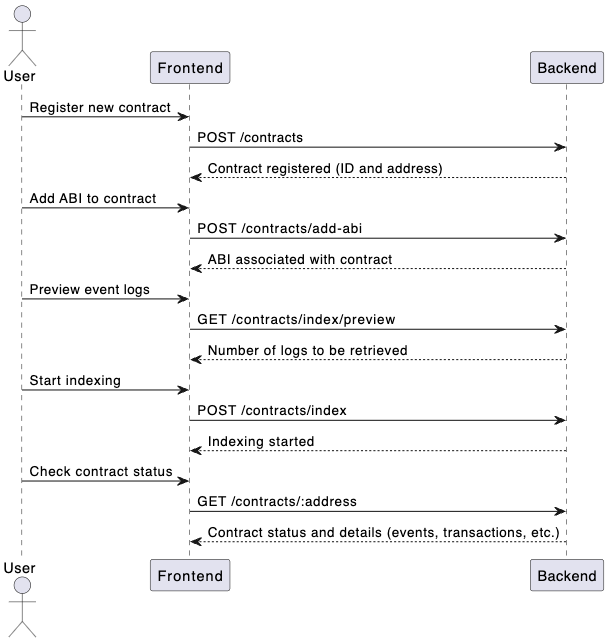

# EchoSmart - Blockchain Contract Indexer

EchoSmart is a comprehensive blockchain indexer for managing and monitoring smart contracts deployed on the Lachain network. It enables users to register their contracts, associate ABIs, and index historical and real-time events and transactions. EchoSmart leverages Lachain’s RPC capabilities to track contract interactions, providing a detailed overview of each contract's activity.

## Project Overview

EchoSmart’s backend is responsible for managing contracts, tracking events, and storing transaction data in a PostgreSQL database. The frontend application, developed in React, offers a clean and intuitive interface for users to visualize and interact with their contracts. 

With EchoSmart, users can:
- Register smart contracts with an associated ABI.
- Index historical events starting from a specific block.
- Query contract data using GraphQL API.
- Visualize contract data, including transaction, event logs, and more.

## Technologies Used

- **Frontend:** React (with Vite), Tailwind CSS
- **Backend:** Node.js, NestJS, Ethers.js
- **Database:** PostgreSQL
- **Deployment:** 
  - Frontend: Vercel
  - Backend: Railway (including PostgreSQL database)

## Project Structure

### Backend

- **Database Schema:** 
  - Contracts: Stores details about each contract, including address, name, ABI, events, and processes.
  - Events & Event Logs: Tracks all events emitted by a contract, including each log’s parameters.
  - Transactions: Records all transactions associated with a contract.
  - Processes: Manages the indexing process status for each contract.
  
- **REST API Endpoints:**
  - `GET /contracts`: Lists all contracts with event and transaction counts.
  - `POST /contracts`: Registers a new contract.
  - `POST /contracts/add-abi`: Associates an ABI with a contract.
  - `DELETE /contracts/:address`: Deletes a contract and all related data.
  - `POST /contracts/index`: Starts indexing events for a contract from a specific block.
  - `GET /contracts/index/preview`: Provides a preview of event logs to be indexed from a given block.
  - `GET /blockchain/info`: Retrieves the current block number and network information.
  
- **Blockchain Interaction:**
  - Uses Ethers.js to connect to Lachain RPC, enabling contract interaction and event filtering.
  - Processes both historical and real-time events by listening to blockchain transactions and parsing logs.
  - Provides real-time updates by capturing event logs and creating transaction entries in the database.

### Frontend

The frontend is a React application structured in a modular format to ensure reusability and separation of concerns.

#### Pages

1. **Landing Page**
   - Main entry point, with options to view all registered contracts or add a new one.

2. **Contracts List Page**
   - Displays all registered contracts with a summary of each contract’s event count and transaction count.

3. **Contract Detail Page**
   - Shows a detailed view of a specific contract, including tabs for:
     - **Event Logs**: Displays logs emitted by the contract.
     - **ABI and Events**: Shows the contract's ABI and defined events.
     - **Transactions**: Lists all transactions involving the contract.
     - **GraphQL** (Planned): Allows users to query data in a more flexible way.

4. **Add Contract Page**
   - Provides a form for users to register a new contract, with fields for the contract address and ABI.

## Documentation and Diagrams

### Class Diagram

The following UML class diagram provides an overview of the main entities in the EchoSmart database schema and their relationships. This includes contracts, events, eventLogs, eventParameters transactions, and processes.

### Sequence Diagram for Indexing

The sequence diagram below illustrates the API calls and database interactions involved when a user initiates the indexing process for a contract. It includes endpoints like `POST /contracts/index` and the subsequent actions to query the blockchain and store event logs.

